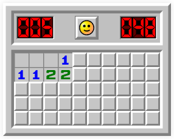
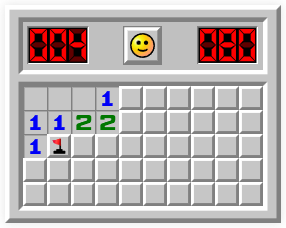
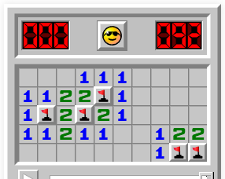
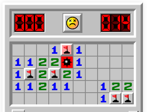

# Minesweeper (kinda)

## Description

## Api

### Starting new game

Request:

```
POST /minesweeper
Content-Type: applciation/json

{
    "height": 5,
    "width": 10,
    "mines": 5
}
```

Initial game response:
```
{
    "state": "PLAY",
    "board": [
        "OOOOOOOOOO"
        "OOOOOOOOOO"
        "OOOOOOOOOO"
        "OOOOOOOOOO"
        "OOOOOOOOOO"
    ]
}
```

Possible game **state**s are: *PLAY, WIN, LOSE*

Where **board** is an array of strings. Each symbol in string represents game cell state. Possilbe values are:

 - O - initial cell state, untouched
 - 1-8 - number of mines around cell
 - F - marked cell as mine
 - M - unmarked mine, shows other mines in case of lose
 - X - mine that caused game lose
 - E - empty cell

### Making game request

Left click to top left cell api call
```
PUT /minesweeper/dig?x=0&y=0
```

Left + right click to top left cell api call. Dig around cell.
```
PUT /minesweeper/around?x=0&y=0
```

Right click to top left cell api call. Put flag assuming there is a mine.
```
PUT /minesweeper/flag?x=0&y=0
```

### Intermediate game response example

```
{
    "state": "PLAY",
    "board": [
        "EEE1OOOOOO"
        "1122OOOOOO"
        "OOOOOOOOOO"
        "OOOOOOOOOO"
        "OOOOOOOOOO"
    ]
}
```


### Marked mine response example

```
{
    "state": "PLAY",
    "board": [
        "EEE1OOOOOO"
        "1122OOOOOO"
        "1FOOOOOOOO"
        "OOOOOOOOOO"
        "OOOOOOOOOO"
    ]
}
```


### Win game response example

```
{
    "state": "WIN",
    "board": [
        "EEE111EEEE"
        "1122F1EEEE"
        "1F2F21EEEE"
        "11211EE122"
        "EEEEEEE1FF"
    ]
}
```


### Lose game response example

```
{
    "state": "LOSE",
    "board": [
        "EEE1F1EEEE"
        "1122X1EEEE"
        "1F2F21EEEE"
        "11211EE122"
        "EEEEEEE1FF"
    ]
}
```


### Errors

TBD
